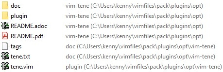
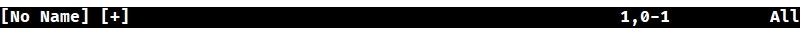
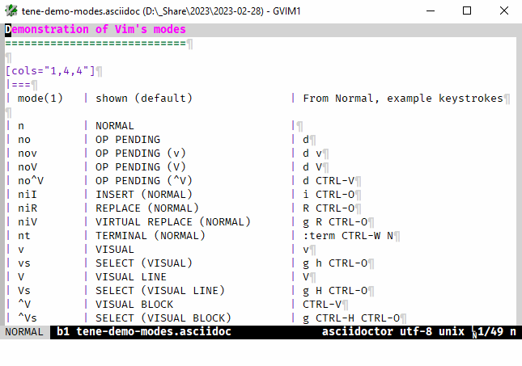

= vim-tene
:author: Peter Kenny
:doctype: article
:icons: font
:pdf-theme: D:\github.kennypete\asciidoc\adoc\pdf\README-theme.yml
:sectnums:
//experimental is needed for kbd:[], which is NOT experimental 
:experimental:
:toc: preamble
//there's no need for a toc title in GitHub/HTML, but in PDF there is
ifndef::backend-html5,env-github[:toc-title: Contents]
ifdef::backend-html5,env-github[:toc-title:]
//only two levels of toc make sense in a PDF
ifndef::backend-html5,env-github[:toclevels: 2]
ifdef::backend-html5,env-github[:toclevels: 4]
//Admonitions are unsatisfying on GitHub: they are not prominent and
//are too small. There seems to be no solution to that?
ifdef::env-github[]
:important-caption: :heavy_exclamation_mark:
:tip-caption: :bulb:
:note-caption: :information_source:
:caution-caption: :fire:
:warning-caption: :warning:
:white-check-mark: :white_check_mark:
endif::env-github[]
ifndef::env-github[]
:white-check-mark: ✓
endif::env-github[]
// Refs to vimhelp.org:
:h: https://vimhelp.org/
// :attributes: only use lowercase, numerals, and hyphens. NB: asciidoctor-pdf-2.3.7 processes uppercase literally, so don't use uppercase.  Refer - https://docs.asciidoctor.org/asciidoc/latest/attributes/names-and-values/
:h-add-global-plugin: {h}usr%5F05.txt.html#add-global-plugin
:h-add-local-help: {h}usr%5F05.txt.html#add-local-help
:h-ascii: {h}various.txt.html#%3Aascii
:h-augroup: {h}autocmd.txt.html#%3Aaugroup
:h-autocmd-groups: {h}autocmd.txt.html#autocmd-groups
:h-autocmd-remove: {h}autocmd.txt.html#autocmd-remove
:h-autocommand: {h}autocmd.txt.html#autocommand
:h-autocommand-events: {h}autocmd.txt.html#autocommand-events
:h-background: {h}options.txt.html#%27background%27
:h-belloff: {h}options.txt.html#%27belloff%27
:h-blowfish2: {h}options.txt.html#blowfish2
:h-bufenter: {h}autocmd.txt.html#BufEnter
:h-buffers: {h}windows.txt.html#buffers
:h-bufnr: {h}builtin.txt.html#bufnr%28%29
:h-buftype: {h}options.txt.html#%27buftype%27
:h-builtin-functions: {h}eval.txt.html#builtin-functions
:h-cmd: {h}map.txt.html#%3CCmd%3E
:h-cmdline: {h}cmdline.txt.html#Cmdline-mode
:h-col: {h}builtin.txt.html#col%28%29
:h-colorscheme: {h}syntax.txt.html#%3Acolorscheme
:h-count: {h}intro.txt.html#count
:h-cryptmethod: {h}options.txt.html#%27cryptmethod%27
:h-ctrl-w-w: {h}windows.txt.html#CTRL-W%5Fw
:h-def: {h}vim9.txt.html#%3Adef
:h-dictionaries: {h}eval.txt.html#Dictionaries
:h-digraph: {h}options.txt.html#%27digraph%27
:h-digraphs-use: {h}digraph.txt.html#digraphs-use
:h-ex: {h}intro.txt.html#mode-Ex
:h-execute: {h}eval.txt.html#%3Aexecute
:h-expression: {h}eval.txt.html#expression
:h-expression-syntax: {h}eval.txt.html#expression-syntax
:h-f: {h}motion.txt.html#f
:h-fu: {h}motion.txt.html#F
:h-folds: {h}fold.txt.html#folds
:h-fold-marker: {h}fold.txt.html#fold-marker
:h-foldmethod: {h}options.txt.html#%27foldmethod%27
:h-g: {h}index.txt.html#g
:h-ga: {h}various.txt.html#ga
:h-get: {h}builtin.txt.html#get%28%29
:h-gvim: {h}starting.txt.html#gvim
:h-gvimrc: {h}gui.txt.html#%2Egvimrc
:h-help-buffer-options: {h}helphelp.txt.html#help%2Dbuffer%2Doptions
:h-highlight-clear: {h}syntax.txt.html#highlight-clear
:h-highlight-default: {h}syntax.txt.html#highlight-default
:h-highlight-groups: {h}syntax.txt.html#highlight-groups
:h-highlight-guibg: {h}syntax.txt.html#highlight-guibg
:h-highlight-guifg: {h}syntax.txt.html#highlight-guifg
:h-hl-diffadd: {h}syntax.txt.html#hl-DiffAdd
:h-hl-errormsg: {h}syntax.txt.html#hl-ErrorMsg
:h-hl-pmenu: {h}syntax.txt.html#hl-Pmenu
:h-hl-statusline: {h}syntax.txt.html#hl-StatusLine
:h-hl-statuslinenc: {h}syntax.txt.html#hl-StatusLineNC
:h-hl-statuslineterm: {h}syntax.txt.html#hl-StatusLineTerm
:h-hl-statuslinetermnc: {h}syntax.txt.html#hl-StatusLineTermNC
:h-hl-visual: {h}syntax.txt.html#hl-Visual
:h-hl-wildmenu: {h}syntax.txt.html#hl-WildMenu
:h-i-ctrl-e: {h}insert.txt.html#i%5FCTRL-E
:h-i-ctrl-k: {h}insert.txt.html#i%5FCTRL-K
:h-i-ctrl-l: {h}insert.txt.html#i%5FCTRL-L
:h-i-ctrl-o: {h}insert.txt.html#i%5FCTRL-O
:h-i-ctrl-q: {h}insert.txt.html#i%5FCTRL-Q
:h-i-ctrl-r: {h}insert.txt.html#i%5FCTRL-R
:h-i-ctrl-v: {h}insert.txt.html#i%5FCTRL-V
:h-i-ctrl-v-digit: {h-i-ctrl-v}%5Fdigit
:h-i-ctrl-y: {h}insert.txt.html#i%5FCTRL-Y
:h-insert: {h}insert.txt.html#Insert-mode
:h-insertmode: {h}options.txt.html#%27insertmode%27
:h-key: {h}options.txt.html#%27key%27
:h-keymap: {h}options.txt.html#%27keymap%27
:h-key-mapping: {h}map.txt.html#key-mapping
:h-laststatus: {h}options.txt.html#%27laststatus%27
:h-leader: {h}map.txt.html#%3CLeader%3E
:h-line: {h}builtin.txt.html#line%28%29
:h-linewise: {h}motion.txt.html#linewise
:h-map: {h}map.txt.html#%3Amap
:h-maparg: {h}builtin.txt.html#maparg%28%29:
:h-map-table: {h}map.txt.html#map-table
:h-mbyte-composing: {h}mbyte.txt.html#mbyte-composing
:h-mbyte-keymap: {h}mbyte.txt.html#mbyte-keymap
:h-mod: {h}options.txt.html#%27mod%27
:h-mode: {h}builtin.txt.html#mode%28%29
:h-modechanged: {h}autocmd.txt.html#ModeChanged
:h-modeline: {h}options.txt.html#modeline
:h-modifiable: {h}options.txt.html#%27modifiable%27
:h-modified: {h}options.txt.html#%27modified%27
:h-netrw: {h}pi_netrw.txt.html
:h-noma: {h}options.txt.html#%27noma%27
:h-noremap: {h}map.txt.html#%3Anoremap
:h-normal: {h}intro.txt.html#Normal-mode
:h-nowrap: {h}options.txt.html#%27nowrap%27
:h-o-ctrl-v: {h}motion.txt.html#o%5FCTRL-V
:h-o-uv: {h}motion.txt.html#o%5FV
:h-o-v: {h}motion.txt.html#o%5Fv
:h-operator-pending: {h}intro.txt.html#Operator-pending
:h-options: {h}options.txt.html#options
:h-packadd: {h}repeat.txt.html#pack-add
:h-packages: {h}repeat.txt.html#packages
:h-packpath: {h}options.txt.html#%27packpath%27
:h-paste: {h}options.txt.html#%27paste%27
:h-plug: {h}map.txt.html#%3CPlug%3E
:h-plugin: {h}usr%5F05.txt.html#plugin
:h-pvw: {h}options.txt.html#%27pvw%27
:h-readonly: {h}options.txt.html#%27readonly%27
:h-recording: {h}repeat.txt.html#recording
:h-redrawstatus: {h}various.txt.html#%3Aredrawstatus
:h-registers: {h}change.txt.html#registers
:h-replace: {h}insert.txt.html#Replace-mode
:h-ro: {h}options.txt.html#%27ro%27
:h-runtime: {h}repeat.txt.html#%3Aruntime
:h-runtimepath: {h}options.txt.html#%27runtimepath%27
:h-safestate: {h}autocmd.txt.html#SafeState
:h-safestateagain: {h}autocmd.txt.html#SafeStateAgain
:h-sb: {h}windows.txt.html#%3Asb
:h-select: {h}visual.txt.html#Select-mode
:h-showmode: {h}options.txt.html#%27showmode%27
:h-softtabstop: {h}options.txt.html#%27softtabstop%27
:h-source: {h}repeat.txt.html#%3Asource
:h-spell: {h}options.txt.html#%27spell%27
:h-startuptime: {h}starting.txt.html#--startuptime
:h-state: {h}builtin.txt.html#state%28%29
:h-statusline: {h}options.txt.html#%27statusline%27
:h-t: {h}motion.txt.html#f
:h-tu: {h}motion.txt.html#T
:h-tab-page-intro: {h}tabpage.txt.html#tab-page-intro
:h-tabline: {h}options.txt.html#%27tabline%27
:h-terminal-normal: {h}intro.txt.html#Terminal-normal-mode
:h-terminal: {h}terminal.txt.html#Terminal-mode
:h-ternary: {h}eval.txt.html#ternary
:h-user-functions: {h}eval.txt.html#user-functions
:h-using-plug: {h}usr_51.txt.html#using-%3CPlug%3E
:h-version9txt: {h}version9.txt.html
:h-vim-8: {h}version8.txt.html#vim-8
:h-vim-802: {h}version8.txt.html#vim-8.2
:h-vim-ex: {h}intro.txt.html#gQ
:h-vim9-mix: {h}vim9.txt.html#vim9-mix
:h-vim9-namespace: {h}vim9.txt.html#vim9-namespace
:h-vim9-script: {h}vim9.txt.html#Vim9-script
:h-vim9script: {h}vim9.txt.html#vim9script
:h-vimrc: {h}starting.txt.html#%2Evimrc
:h-virtcol: {h}builtin.txt.html#virtcol%28%29
:h-visual: {h}visual.txt.html#Visual-mode
:h-vreplace: {h}insert.txt.html#Virtual-Replace-mode
:h-windows: {h}windows.txt.html#window
:h-x: {h}editing.txt.html#%3AX

// Abstract (block) works best for the intro paragraph between the article title and the Installation section.
// https://docs.asciidoctor.org/asciidoc/latest/sections/abstract-block/
// For GitHub it is superfluous
ifndef::backend-html5,env-github[[abstract]]
--

'''

vim-tene is a {h-vim9-script}[Vim9 script] {h-plugin}[plugin].
It produces a highly configurable, conceptually straightforward, {h-statusline}[statusline], using no {h-user-functions}[user-defined functions], and is built via a sequence of {h-expression}[expressions] using {h-ternary}[ternary] operators.

'''
--

[#tene-examples]
== Example vim-tene statuslines

It is not easy to outline all of the features of vim-tene, though here are three condensed examples as a taster.

 

 

'''

 

 

'''

 

<<<

&#xa0;

[#tene-installation]
== Installation

**vim-tene is built primarily for {h-version9txt}[Vim 9].**

However, some of the later patches of {h-vim-802}[Vim 8.2] work too.
_See_&#xa0;<<#tene-Vim-8>> for details.

[WARNING]
====
. Versions from 8.2.3555 through to the final patch of version 8.2footnote:[That is, Windows versions between https://github.com/vim/vim-win32-installer/releases/tag/v8.2.3457[v8.2.3557] and https://github.com/vim/vim-win32-installer/releases/tag/v8.2.5171[v8.2.5171], and Unix versions between https://github.com/vim/vim/tags?after=v8.2.3556[v8.2.3555] and https://github.com/vim/vim/archive/refs/tags/v8.2.5172.tar.gz[v8.2.5172].] work almost as well as {h-version9txt}[Vim 9].footnote:[I&#xa0;tested Windows https://github.com/vim/vim-win32-installer/releases/tag/v8.2.5171[v8.2.5171] and built and tested on WSL Debian 11, a laptop with Debian 11, and a Raspberry Pi Zero (Debian 10.13) using https://github.com/vim/vim/archive/refs/tags/v8.2.5172.tar.gz[v8.2.5172].]
However, since {h-vim9-script}[Vim9 script] was not officially released until {h-version9txt}[Vim 9] (2022-06-29), it is likely some of those later patched {h-vim-802}[Vim 8.2] instances will not work as well as, especially a later, Vim 9 version.footnote:[_Refer_, for example, https://github.com/vim/vim-win32-installer/releases?q=ModeChanged&expanded=true[GitHub] for the places {h-modechanged}[ModeChanged] has been patched to learn the reasons for this.]

. Versions from 8.2.3434footnote:[Version 8.2.3434: https://github.com/vim/vim-win32-installer/releases/tag/v8.2.3434[Windows] and https://github.com/vim/vim/tags?after=v8.2.3435[Unix].] to v8.2.3554 mostly work, though not all {h-mode}[modes] will show in the {h-statusline}[statusline], e.g., {h-operator-pending}[Operator-pending] does not trigger {h-modechanged}[ModeChanged], which https://github.com/vim/vim/commit/25def2c8b8bd7b0c3d5f020207c717a880b05d50[patch 8.2.3555] addressed.

. Using {h-vim-8}[Vim 8] versions earlier than 8.2.3434 (i.e., versions prior to the addition of the {h-modechanged}[ModeChanged] {h-autocommand-events}[autocommand event], vim-tene will only produce a basic, static {h-statusline}[statusline].

. It will not work with Neovim.
That is not only because the code is {h-vim9-script}[Vim9 script], but also for reasons including that Vim&#x2019;s {h-builtin-functions}[builtin function] {h-state}[state()], which is used in several places, is not available in Neovim (at the time of writing, 2023-04-16).footnote:[_Refer_&#xa0;https://neovim.io/doc/user/builtin.html[Neovim builtin functions].  It is not hard to remove some code (and consequently, functionality) that relies on {h-state}[state()], add `let` to variables, etc., and that would make a _not-as-featured_ Neovim version.  In fact, I started doing it just to validate it is feasible; broadly, it is.  There also appears to be a redrawing issue with Neovim in that updating the mode indicator appears to be delayed, but there is probably a solution for that (perhaps another {h-autocommand}[autocommand(s)]). However, because I do not use Neovim, and it would sufficiently diverge to being a different plugin, someone else can look at doing that.]
====

The recommended way to use this plugin is to use {h-packadd}[packadd!] in your {h-vimrc}[~/.vimrc], though several options are outlined, below.
If you use a plugin manager (other than vim-plug, the only manager included, below) it should have detailed instructions for how to install plugins using it.

=== Using packadd! in your .vimrc &#x5b;recommended&#x5d;

*_Either_* `git clone pass:[https://github.com/kennypete/vim-tene] ~/.vim/pack/plugins/opt/vim-tene` *_or_*&#xa0;download the .zip from https://github.com/kennypete/vim-tene and unzip the contents within the folder vim-tene-main to `~/.vim/pack/plugins/opt/vim-tene`.

You should have a directory structure like this (Linux and Windows respectively):

[.text-center]

&#xa0; &#xa0;

In your {h-vimrc}[~/.vimrc] add `packadd! vim-tene`.
For an example of this, _see_ <<#tene-vimrc-packadd>>.

[TIP]
====
This is a contemporary and versatile way of using plugins.
If you want to turn them off, it&#x2019;s easy &#x2014; comment out `packadd! vim-tene`.
====

=== Vim&#x2019;s packages method, automatically

|===
a|Similar to the above, except using `start` rather than `opt` … +
*_Either_* `git clone pass:[https://github.com/kennypete/vim-tene] ~/.vim/pack/plugins/start/vim-tene` *_or_*&#xa0;download the .zip from https://github.com/kennypete/vim-tene and unzip the contents within the folder vim-tene-main to `~/.vim/pack/plugins/start/vim-tene`.

TIP: This is a contemporary, though less versatile way of using plugins. +
If you want to turn one/more off you need to move it/them out of your `start` directory.
|===

=== Using a plugin manager

|===
a|For example, https://github.com/junegunn/vim-plug[vim-plug] (using &#x201c;shorthand notation&#x201d;).

In the vim-plug section of your {h-vimrc}[.vimrc], add `Plug 'kennypete/vim-tene'` between `call plug#begin()` and `call plug#end()`.
Reload your {h-vimrc}[.vimrc] and `:PlugInstall` to install plugins.

NOTE: This is just one plugin example. +
Also, it is not the only way vim-plug could be used.
|===

=== As a &#x201c;global&#x201d; plugin

|===
a|As vim-tene is a unitary {h-vim9-script}[Vim9 script], it can be added easily as a {h-add-global-plugin}[global plugin] to your `~/.vim/plugin` directory.

Download the .zip from https://github.com/kennypete/vim-tene and unzip the contents.

Copy `tene.vim` to  your `~/.vim/plugin` directory.

If you want the help file too, copy `tene.txt` from the .zip file to  your `~/.vim/doc` directory.
Either copy `tags.` there too or rebuild the tags.
That is explained in {h-add-local-help}[add-local-help].

TIP: This may be your preferred method if you use very few plugins. +
It also avoids using contemporary means of using plugins.
|===

=== Sourced directly by your ~/.vimrc

|===
a|Finally, another option is to {h-source}[:source] tene.vim directly or use {h-runtime}[:runtime].

Put tene.vim into your `~/.vim` directory (or anywhere in your {h-runtimepath}[runtime path]) and `:ru tene.vim`.

You would not automatically get the benefits of the help file, but this just illustrates the simplicity, versatility, and portability that comes with being one .vim file.

TIP: This may be your preferred method if you use a lot of different versions of Vim, including old ones. +
(Including because `packadd` will not work below version 704 with patch 1485).
|===

[CAUTION]
[%unbreakable]
====
. If your operating system is Windows, instead of `~/.vim/`:
* In PowerShell, use `$HOME\vimfiles\` or `~/vimfiles/`, or
* In Command Prompt, use `%USERPROFILE%\vimfiles\`.
. In the paths above, `plugins` may be whatever name you like (noting {h-packpath}['packpath'] is scanned for plugins under the `start` directory (automatically) and `opt` when {h-packadd}[packadd] is executed).
. You may also add configuration options to your {h-vimrc}[~/.vimrc] &#x2014; _see_&#xa0;<<tene-configuration>>.
====

[#tene-aims]
== Aims

The vim-tene {h-plugin}[plugin] began as an experiment to see whether a {h-statusline}[statusline] with lots of features could work using only {h-ternary}[ternary]footnote:[Incidentally, Vim&#x2019;s help considers {h-expression}[expressions] using ternary operators the &#x201c;least &#x2026; significant&#x201d; of Vim&#x2019;s expressions.  Not in this plugin!  _Refer_ {h-expression-syntax}[expression-syntax].] expressions (plus _with_ Vim&#x2019;s {h-builtin-functions}[builtin functions], but especially _without_ complex {h-user-functions}[user-defined functions], often spread across many vimscript files).

Aims expanded, as things progressed, to include:

. [[aim1]]Handle every {h-mode}[mode], where practicable.
Some {h-statusline}[statusline] plugins don&#x2019;t display {h-vim-ex}[Vim Ex] or {h-ex}[Ex], for example.
{h-operator-pending}[Operator-pending] modes (no, {h-o-v}[nov], {h-o-uv}[noV] and {h-o-ctrl-v}[noCTRL-V]) also seemed to be either non-handled or ignored by {h-statusline}[statusline] {h-plugin}[plugins].

. [[aim2]]Provide lots of configuration options, both at startup and interactively.
The latter is important because not all editing scenarios, including intra-session, are the same.
So, whereas knowing what Unicode character (or _characters_, i.e., including composing characters) is under the cursor may be critical sometimes, other times it may be inconsequential.
Hence, providing interactive toggling of features was important.footnote:[There is always {h-ga}[ga] or {h-ascii}[:ascii] to get that information in this instance, but that requires keystrokes, especially when not in {h-normal}[Normal] mode.] <<tene-illustrating-toggling-variables>> shows this in action.

. [[aim3]]https://www.vi-improved.org/plugins[&#x201c;Do no harm&#x201d;] / don&#x2019;t break Vim&#x2019;s core features.

. [[aim4]]Respect users&#x2019; settings and {h-colorscheme}[colorschemes].
In terms of the latter, keep it low effort by &#x201c;recycling&#x201d; default {h-highlight-groups}[highlight groups], and leave it to users to do their own thing otherwise.

. [[aim5]]Keep things clean.
Tab / triangular characters such as U+E0B0 and U+E0B1footnote:[The Unicode codes only are indicated here because fonts that display them cannot be used, as far as I&#x2019;m aware, on Github.] provided by Powerline enabled &#x2f; patched fonts consume {h-statusline}[statusline] &#x201c;real estate&#x201d;.
Don&#x2019;t, by default, use those where there isn&#x2019;t any useful information provided to the user.
So, line and column number indicators are fine (because they are no more verbose than &#x201c;L&#x201d; or &#x201c;C&#x201d;, for example) whereas the pointer / triangular characters noted are not.
Also enable using nothing at all if that is your preference, e.g.,&#xa0;&#x201c;282/1270&#xa0;96&#x201d; with no line or column indicators at all.
Similarly colours: providing mode indicators in different colours makes sense because visually it reminds you you are in a certain {h-mode}[mode]/mode group, but applying colours everywhere because you can?
NB: If you want _Joseph and the Amazing Technicolour Dreamcoat_, this isn&#x2019;t the plugin for you.  😂

. [[aim6]]Notwithstanding <<aim5,aim&#xa0;&#x23;5>>, provide for Unicode and Powerline characters for indicators like {h-modified}['modified'], {h-readonly}['readonly'], etc.
That&#x2019;s consistent with simplicity and utility, e.g., one character such as U+F457 consumes less screen space, and resembles Vim&#x2019;s default, i.e., [+], which consumes three characters.
And making it configurable (<<tene-config-glyphs>>) means it&#x2019;s easy, if you want to use ASCII characters exclusively, only to use those.

. [[aim7]]Be independent of, but also not break, other plugins.
Trying to be all things to all people is unwise.
Plus <<aim3,aim&#xa0;&#x23;3>> and <<aim4,aim&#xa0;&#x23;4>> would not be met.

. [[aim8]]Run vim-tene in the way you prefer.
Use {h-packadd}[packadd!] manually, load with Vim&#x2019;s {h-packages}[packages] automatically, load with a plugin manager, or {h-source}[:source] &#x2f; {h-runtime}[:runtime] vim-tene.vim directly.
Make all those options straightforward.

. [[aim9]]Use {h-vim9-script}[Vim9 script].
{h-version9txt}[Vim 9] (or {h-vim-802}[Vim 8.2] with at least https://github.com/vim/vim/releases/tag/v8.2.3534[patch 3434], though preferably with https://github.com/vim/vim/releases/tag/v8.2.3555[patch 3555]) is needed because the {h-modechanged}[ModeChanged] {h-autocommand-events}[autocommand event], is essential &#x2015; _see_&#xa0;<<tene-augroup>> &#x2015; and since {h-vim9-script}[Vim9 script] was enabled at that point it was feasible to use it.footnote:[There was a conundrum determining this.
Other &#x201c;cut off&#x201d; points could logically have been chosen.
One such point could have been https://github.com/vim/vim/commit/b79ee0c299d786627784f7304ba84b80e78ece26[patch 3965], 2022-01-02, &#x201c;Vim9: no easy way to check if Vim9 script is supported&#x201d;, when `has('vim9script')` first returns 1.
Another possibility was, if {h-def}[:def] functions had been utilised, https://github.com/vim/vim/commit/ac48506ac62b2ece523d5af6ea6c95b699d70b94[patch 4615], 2022-03-24, when &#x201c;mapping with escaped bar does not work in :def function&#x201d; was fixed.
In the end I chose the {h-modechanged}[ModeChanged] {h-autocommand-events}[autocommand event] date (https://github.com/vim/vim/commit/28e591dd5080bbcd0f468f9d9597cedb716e28c9[patch 8.2.3434], 2021-09-13, &#x201c;function prototype for trigger_modechanged() is incomplete&#x201d;) because that was the critical addition enabling detection of mode changes, though it was a close call with https://github.com/vim/vim/releases/tag/v8.2.3555[patch 3555], because not all {h-mode}[mode] changes were detectable until then (2021-10-23).
And since {h-vim9-script}[Vim9 script] was sufficiently stable by that time, choosing to use it was an arbitrary, personal, choice.]

. [[aim10]]Provide a static {h-statusline}[statusline] that&#x2019;s more feature rich than the standard when sourced with a version that cannot handle {h-vim9-script}[Vim9 script] &#x2015; _see_&#xa0;<<tene-Vim-8>> &#x2015; so that vim-tene does not cause errors when sourced by older versions.

. [[aim11]]Don&#x2019;t utilise any {h-user-functions}[user-defined functions].

. [[aim12]]Utilise only (a) {h-expression}[expressions] using {h-ternary}[ternary] operators, and (b) Vim&#x2019;s {h-builtin-functions}[builtin functions].

Keeping to these aims mostly reduced complexity.footnote:[Clearly the nested {h-ternary}[ternary] {h-expression}[expressions] are complex.
They even may be viewed as an abomination by some.
Nonetheless, _conceptually_, the end result is simple.]
Some {h-statusline}[statusline] plugins have extraordinary amounts of code, often dedicated to accommodating other plugins, appearing to prioritise &#xe6;sthetics over utility.

[#tene-the-standard-statusline]
=== The standard statusline

When Vim loads, and {h-laststatus}['laststatus'] equals 2, Vim will draw a {h-statusline}[statusline] at the bottom of each window.
Vim&#x2019;s &#x201c;standard&#x201d; statusline may be emulated with one short command:

// NB: [source,vim is being used here because GitHub does some source code highlighting with vim, but not with vimscript or vim9script]
ifdef::env-github[[source,vim]]
ifndef::env-github[[source,vimscript]]
----
set statusline=%<%f\ %h%m%r%=%-14.(%l,%c%V%)\ %P
----

|===
a|A &#x201c;translation&#x201d; of that command is, &#x201c;Set the statusline to&#x201d;:

. Truncate the statusline at the start, when necessary (%&lt;)
. Show the path to the file in the buffer, as typed or relative (%f)
. Insert a space (\ )
. Display &#x201c;[help]&#x201d; buffer flag, when applicable (%h)
. Display &#x201c;[+]&#x201d; {h-modified}['modified'] flag / &#x201c;[-]&#x201d; if {h-modifiable}['modifiable'] is off (%m)
. Display &#x201c;[RO]&#x201d; {h-readonly}['readonly'] flag, when applicable (%r)
. Right align the remainder of the {h-statusline}['statusline'] (%=)
. Pad with spaces up to 14 characters (%-14.(&#x2026;))
. Display line number, a comma, and column-virtual column (%l,%c%V)
. Insert a space (\ )
. Display All/Top/Bot/percentage through the buffer&#x2019;s window (%P)

|===

To illustrate, the &#x201c;standard&#x201d; {h-statusline}[statusline], for a {h-modified}[modified], unsaved buffer, and with no content will appear like this:

This plugin, as others do, extends way beyond the &#x201c;standard&#x201d;.
In this plugin&#x2019;s case, there are myriad options set by default.
Many may be configured (_see_&#xa0;<<tene-configuration>>) in your {h-vimrc}[~/.vimrc] or via {h-leader}[<Leader>] mappings, which may be used to toggle features interactively (_see_&#xa0;<<tene-leader-mappings>>).

Although a great deal is configurable, there are limits.
For example, unlike some {h-statusline}[statusline] plugins, the order of what appears is fixed.
That is a pragmatic limitation of the self-imposed constraints noted in <<tene-aims>> and <<tene-features>>, including only using {h-ternary}[ternary] {h-expression}[expressions].
Whether that is a limitation you are willing to accept is up to you.

Another limitation is colours ({h-highlight-groups}[highlight groups]): they have been set to leverage a few of Vim&#x2019;s default highlight groups.
That&#x2019;s because those won&#x2019;t be reset when a {h-colorscheme}[colorscheme] is loaded and {h-highlight-clear}[highlight-clear] is executed.
It has also been limited to the {h-mode}[mode] indicator/name and &#x201c;the rest&#x201d;.
That is a sensible decision because it would make the {h-ternary}[ternary] {h-expression}[expressions] extremely complicated if lots of highlighting optionality was included (and that&#x2019;s unnecessary).
It is also consistent with keeping things &#x201c;clean&#x201d; &#x2015; _see_&#xa0;<<aim5,aim&#xa0;#5>>.

[NOTE]
====
The {h-tabline}['tabline'] is not in scope of this plugin.
It is *statusline only*.
The default tab handling in Vim is fine (if tabs are used as described in the {h-tab-page-intro}[tabpage] introduction, not proxy {h-buffers}[buffers]footnote:[That&#x2019;s not hating on you if you do use tabs like {h-buffers}[buffers] &#x2015; it&#x2019;s your choice &#x2015; you do you.  😉]).

Here&#x2019;s a {h-gvim}[gvim] option for your {h-vimrc}[~/.vimrc] or {h-gvimrc}[~/.gvimrc] if you want a {h-tabline}['tabline'] with information that _is_ useful (buffer numbers appearing in each tab and the tab&#x2019;s active window&#x2019;s buffer name):

ifdef::env-github[[source,vim]]
ifndef::env-github[[source,vimscript]]
----
set guitablabel=%{%join(tabpagebuflist('%'),'\ ◆\ ')..'\ %t'%}
----
====

[#tene-features]
== Features

// Ideally specifying a list bullet type would be possible.  Even in "normal"
// Asciidoc, that's not a thing.  On GitHub it's worse: e.g., you cannot even
// specify [none] ... it's ignored.  Here, the approach is to just use normal
// paragraphs and, for GitHub, the :white_check_mark:, otherwise U+2705 ✅

{white-check-mark} Handles  _all_ of Vim&#x2019;s {h-mode}[modes],footnote:[This relies on the {h-modechanged}[ModeChanged] {h-autocommand-events}[autocommand event] enabled with version 8.2 patches https://github.com/vim/vim/commit/28e591dd5080bbcd0f468f9d9597cedb716e28c9[3434] (2021-09-13) and https://github.com/vim/vim/commit/25def2c8b8bd7b0c3d5f020207c717a880b05d50[3555] (2021-10-23).  _See_&#xa0; <<tene-augroup>>.  Also _refer_&#xa0;https://github.com/vim/vim/pull/8856[Pull request 8856].] except {h-mode}[modes] where no {h-statusline}['statusline'] is displayed &#x2015; _see_&#xa0;<<tene-vims-modes-demonstrated>>

{white-check-mark} Shows pending states, i.e.:

* {h-operator-pending}[Operator-pending] (no, plus {h-o-v}[nov], {h-o-uv}[noV] and {h-o-ctrl-v}[noCTRL-V]), and
* In {h-insert}[Insert] (i.e., including {h-replace}[Replace] and {h-vreplace}[Virtual Replace]) modes:
** {h-i-ctrl-k}[CTRL-K] ({h-digraphs-use}[digraphs]),
** {h-i-ctrl-r}[CTRL-R] ({h-registers}[registers]), and
** {h-i-ctrl-v}[CTRL-V] (special keys or decimal, octal or hexadecimal values of a character &#x2015; {h-i-ctrl-v-digit}[i_CTRL-V_digit])

{white-check-mark} Up to three characters under the cursor may be identified, i.e. with up to
two composing characters identified &#x2015; so, up to three Unicode U+nnnnn
can be shown, e.g.:

* *A* will show U+61
* *A&#x0304;* will show U+61,U+304
* *A&#x0328;&#x0304;* will show U+61,U+328,U+304
+
(_See_&#xa0;<<tene-config-toggle-Unicode>>.)

{white-check-mark} Many configuration options to turn on/off features and change information

{white-check-mark} Configuration via {h-vimrc}[~/.vimrc] and interactively with remappable {h-leader}[<Leader>] mappings

{white-check-mark} Independent &#x2015; neither impacts other plugins nor relies on any

{white-check-mark} Only uses {h-ternary}[ternary] {h-expression}[expressions] and Vim&#x2019;s {h-builtin-functions}[builtin functions], and no {h-user-functions}[user-defined functions]

{white-check-mark} Unitary &#x2015; it&#x2019;s a single {h-vim9-script}[Vim9 script]

{white-check-mark} Sequential &#x2015; the {h-vim9-script}[Vim9 script] may be read line-by-line

{white-check-mark} Terse &#x2015; it&#x2019;s only around 140 lines of substantive code, albeit some are very long!

{white-check-mark} Fastfootnote:[The {h-vim9-script}[expected] 10x to 100x speed increase delivered by Vim9 script is not critical to this plugin.
That&#x2019;s because once the {h-statusline}[statusline] has been set, and configuration options are applied, vim-tene&#x2019;s job is done.
It is not a script that has functions called repeatedly nor does it perform any complex actions, e.g., substituting a complex pattern across a large buffer(s), which, from personal experience there is a huge speed performance gain versus vimscript.] - consistently sourced in only 2ms-4ms.footnote:[On a mid-high spec Windows 10 desktop (Intel Core i7-6700, 32GB RAM) it was always 2ms (Vim and {h-gvim}[gvim] using {h-startuptime}[&#x2011;&#x2011;startuptime]).
//footnote continues
That doubled to 4ms-5ms on a lower spec Debian 11 laptop (AMD A8 7140, 8GB RAM), so still imperceptable.
//footnote continues
On a Raspberry Pi Zero that jumped to 26ms, but that was expected because all sourced .vim files took around 10x-15x longer on the Pi &#x2015; that&#x2019;s hardly suprising for an ARM1176 and only 500MB RAM!
//footnote continues
(As an aside, Vim on the Pi seems picky, even defective at times: I could not get any {h-packadd}[packadd] to work on it &#x2015; the only way I could get tene.vim (or any plugin or .vim file) to load was to put it in the `/usr/local/share/vim/vim82/plugin` directory.
//footnote continues
That was despite having identical built versions (2.8 with patch 5172), identical {h-vimrc}[~/.vimrc] files, and identical `pack` directory structures.)]

[#tene-vims-modes-demonstrated]
=== All of Vim&#x2019;s modes demonstrated

ifdef::env-github,backend-html5[]
This animated .gif shows all of Vim&#x2019;s {h-mode}[modes], how they may be accessed, and how they display on the {h-statusline}[statusline] using vim-tene.
The .gif loops, though it takes a while to demonstrate everything so, if you want to start from the beginning, right-click the image and choose the option to open it in a new tab/window.

endif::env-github,backend-html5[]

ifndef::backend-html5,env-github[link:https://gist.github.com/kennypete/0057cdc734b5b55d07edd0094a1f4633/raw/4662eb72cde14b563c77708bb907e82fe817611d/tene-demo-modes.gif[Demonstration of modes]]

[#tene-configuration]
== Configuration

There are many configuration options:

* <<tene-config-mode-names>>
* <<tene-config-state-S>>
* <<tene-config-glyphs>>
* <<tene-config-toggles>>
* <<tene-config-leader-keys>>

Highlight groups are discussed separately.
_See_&#xa0;<<tene-highlighting>>.

[#tene-config-mode-names]
=== Mode Names

Default names are set for {h-mode}[modes] so if you are happy with those there is nothing to do.
If you do want to change a name (or two, or all) it is simply a matter of
adding a few lines of code to your {h-vimrc}[~/.vimrc]; the following example
illustrates changing NORMAL to M&#x100;ORI, which in M&#x101;ori literally means normal!

// Horizontal description list used here on Github since it does not handle callout numbers nicely, but for everything else, use callouts.
// There are no other code examples in here where callouts would work well because the explanations elsewhere are for parts of lines, whereas callouts are for full lines.
ifdef::env-github[]
[source,vim]
----
let g:tene_modes = exists("g:tene_modes") ? g:tene_modes : {}
let g:tene_modes["n"] = "MĀORI"
----
Line 1:: adds the empty {h-dictionaries}[dictionary] if it does not already exist, but leaves the dictionary as-is if it does).
Line 2:: illustrates configuring the text that will be displayed for key "n". +
endif::env-github[]
ifndef::env-github[]
[source,vimscript]]
----
let g:tene_modes = exists("g:tene_modes") ? g:tene_modes : {} <1>
let g:tene_modes["n"] = "MĀORI" <2>
----
<1> adds the empty {h-dictionaries}[dictionary] if it does not already exist, but leaves the dictionary as-is if it does).
<2> illustrates configuring the text that will be displayed for key "n". +
endif::env-github[]

The configurable items are listed in the table below.
Renaming them from the default (column 2) involves determining the right dictionary key from column 1, e.g., in the example above, "n", and choosing whatever you want the mode name to appear as.

//Oddly, GitHub centres the header row's cells in tables whereas it does not
//honour centring of cells, i.e., ^| are not enabled!  It seems like random
//treatment?  NB: Adding < to | does not force left cell alignment either.
[cols="5,8,4"]
|===
^|g:tene_modes['&#x2026;'] |Mode Name (default)          |From Normal Mode

^|*n*                      |NORMAL                       |
^|*no*                     |OP PENDING                   |kbd:[d]
^|*nov*                    |OP PENDING (v)               |kbd:[d]kbd:[v]
^|*noV*                    |OP PENDING (V)               |kbd:[d]kbd:[V]
^|*noCTRL-V*               |OP PENDING (^V)              |kbd:[d]kbd:[CTRL-V]
^|*niI*                    |INSERT (NORMAL)              |kbd:[i]kbd:[CTRL-O]
^|*niR*                    |REPLACE (NORMAL)             |kbd:[R]kbd:[CTRL-O]
^|*niV*                    |VIRTUAL REPLACE (NORMAL)     |kbd:[g]kbd:[R]kbd:[CTRL-O]
^|*nt*                     |TERMINAL (NORMAL)            |kbd:[:term]kbd:[CTRL-W]kbd:[N]
^|*v*                      |VISUAL                       |kbd:[v]
^|*vs*                     |SELECT (VISUAL)              |kbd:[g]kbd:[h]kbd:[CTRL-O]
^|*V*                      |VISUAL LINE                  |kbd:[V]
^|*Vs*                     |SELECT (VISUAL LINE)         |kbd:[g]kbd:[H]kbd:[CTRL-O]
^|*CTRL-V*                 |VISUAL BLOCK                 |kbd:[CTRL-V]
^|*CTRL-Vs*                |SELECT (VISUAL BLOCK)        |kbd:[g]kbd:[CTRL-H]kbd:[CTRL-O]
^|*s*                      |SELECT                       |kbd:[g]kbd:[h]
^|*S*                      |SELECT LINE                  |kbd:[g]kbd:[H]
^|*CTRL-S*                 |SELECT BLOCK                 |kbd:[g]kbd:[CTRL-H]
^|*i*                      |INSERT                       |kbd:[i]
^|*ic*                     |INSERT COMPLETION C          |kbd:[i]kbd:[CTRL-X]kbd:[CTRL-\]]
^|*ix*                     |INSERT COMPLETION X          |kbd:[i]kbd:[CTRL-X]
^|*R*                      |REPLACE                      |kbd:[R]
^|*Rc*                     |REPLACE COMPLETION C         |kbd:[R]kbd:[CTRL-X]kbd:[CTRL-\]]
^|*Rx*                     |REPLACE COMPLETION X         |kbd:[R]kbd:[CTRL-X]
^|*Rv*                     |VIRTUAL REPLACE              |kbd:[g]kbd:[R]
^|*Rvc*                    |VIRTUAL REPLACE COMPLETION C |kbd:[g]kbd:[R]kbd:[CTRL-X]kbd:[CTRL-\]]
^|*Rvx*                    |VIRTUAL REPLACE COMPLETION X |kbd:[g]kbd:[R]kbd:[CTRL-X]
^|*c*                      |COMMAND-LINE                 |kbd:[:]
^|*cv*                     |VIM EX                       |kbd:[g]kbd:[Q]
^|*ce*                     |EX                           |kbd:[Q]
^|*t*                      |TERMINAL-JOB                 |kbd:[:term]
|===

[NOTE]
====
. The keys are identical to the mode codes used in {h-mode}[mode()].
. In column 3, these are illustrative only, e.g., d V is not the only way to
  get to {h-linewise}[linewise] {h-operator-pending}[Operator-pending] ({h-o-uv}[noV]) mode.
(NB: Spaces are included for readability only.)
. Modes r, rm, r? and ! have no {h-statusline}[statusline], so are not defined.
The modes above are listed in the order in {h-mode}[mode()] (and which is followed by vim-tene).
The defaults are built into the {h-ternary}[ternary] {h-expression}[expressions] using {h-get}[get()], i.e.,

 get({dict}, {key} [, {default}])
+
This is an efficient way to set defaults for the 31 names.

====

[#tene-vims-showmode-option]
==== Vim&#x2019;s 'showmode' option

Vim&#x2019;s default approach is to {h-showmode}['showmode'], which puts a message on the last line, for example, when in {h-insert}[Insert mode], *&#x2011;&#x2011;&#xa0;INSERT&#xa0;&#x2011;&#x2011;* is displayed.

Some Vim users turn off {h-showmode}['showmode'] when there is a {h-statusline}[statusline] plugin active.
You may choose to do that, of course.
However, there are times when the combination of {h-showmode}['showmode'] and a {h-statusline}[statusline] mode indicator are really useful.
An example is where {h-i-ctrl-o}[CTRL-O] is used in {h-insert}[Insert mode] and v is entered.
The mode, as revealed by mode/state indicators, is v ({h-visual}[Visual]) and the {h-state}[state] is S (not triggering {h-safestate}[SafeState] or {h-safestate}[SafeStateAgain]) so the {h-mode}[mode] indicated in the {h-statusline}[statusline] should be v or VISUAL (i.e., if defaults are used: `mode(1)==#"v"`).
However, {h-showmode}['showmode'] will display *&#x2011;&#x2011;&#xa0;(insert)&#xa0;VISUAL&#xa0;&#x2011;&#x2011;*, which is more precise because you are not simply in {h-visual}[Visual] mode (accessed, via {h-normal}[Normal] mode, entering v).
The critical point is, you will revert to {h-insert}[Insert mode] when you leave Visual mode.
So, turn off {h-showmode}['showmode'] if you wish, hiding Vim&#x2019;s default information, but only if you accept such downsides.

[#tene-config-state-S]
=== Digraph/Register/Special character &#x201c;pending&#x201d;

S {h-state}[state] occurs in an {h-insert}[Insert mode], i.e., any of {h-insert}[Insert], {h-replace}[Replace] (&#x200b;R) or {h-vreplace}[Virtual Replace] (Rv), when you type one of:

{h-i-ctrl-k}[kbd:[CTRL-K]]::
Enters a {h-digraphs-use}[digraph], e.g., from Insert mode, kbd:[CTRL-K]kbd:[o]kbd:[o] produces U+2022, a bullet (&#x2022;)

{h-i-ctrl-r}[kbd:[CTRL-R]]::
Inserts the contents of a register, e.g., kbd:[:] puts the most recent command-line command

{h-i-ctrl-v}[kbd:[CTRL-V]]::
Either inserts literal characters, e.g., a kbd:[Tab] _even when that is usually overridden with_ {h-softtabstop}['softtabstop'], or, e.g., a Unicode character such as kbd:[CTRL-V]kbd:[u]kbd:[2]kbd:[0]kbd:[2]kbd:[2] will enter the &#x2022; character.
+
TIP: {h-i-ctrl-q}[kbd:[CTRL-Q]] is a synonym for {h-i-ctrl-v}[kbd:[CTRL-V]], which is useful if you ever find MS Windows preventing you using kbd:[CTRL-V] (commonly used by Windows for &#x201c;paste&#x201d;).

The default indicator has been set to &#x201c;&#xa0;I&#xa0;&#x201d;.
That may be overridden by setting g:tene_state_S in your {h-vimrc}[~/.vimrc].
For example, if you wanted something ludicrously verbose:

ifdef::env-github[[source,vim]]
ifndef::env-github[[source,vimscript]]
----
let g:tene_state_S = ' iK/iR/iQ/iV Pending '
----

If you do not want anything to appear, no problem, `let g:tene_state_S = ''` will do that.

[#tene-config-glyphs]
=== Glyphs: Unicode or ASCII

Several indicators may appear in a {h-statusline}[statusline].
Some common ones are *[+]*, which indicates a {h-modified}[modified] buffer, and *[help]*, which shows you that the buffer is of the type Vim help.
These are part of Vim&#x2019;s &#x201c;standard&#x201d; {h-statusline}[statusline], discussed in <<tene-the-standard-statusline>>.

Many other indicators could be displayed.
Some are useful, such as when a {h-key}['key'] is encrypting the file you&#x2019;re editing.
Vim has masses of {h-options}[options], some of which make sense to display when they&#x2019;re set, others not so much.

The default is to show symbols/glyphs, which include a few Powerline characters.
Whether that&#x2019;s the right default is debatable, though users who prefer it off are probably more capable generally, so adding the line to make that happen should be a breeze for them, i.e.:

ifdef::env-github[[source,vim]]
ifndef::env-github[[source,vimscript]]
----
let g:tene_glyphs = 0
----

When this variable is set to 1, the default glyphs are ones that display nicely with font https://www.nerdfonts.com/font-downloads[FiraCode NFM].
Some are Powerline characters such U+30A1 used to indicate the line number.
When set to 0, the ASCII character used for line number is the underscore (_), which is ASCII 95 (U+005F).

Vim-tene sets ASCII character and glyph defaults, so, if you are happy with the default ASCII and/or Unicode glyphs, there is nothing for you to do.
If you do want to change one (or two, or all) it is simply a matter of adding the applicable lines of code to your {h-vimrc}[~/.vimrc].
Illustrated below, is changing the {h-digraphs-use}[digraph] indicator to the &#e6; ligature (U+00E6) when ASCII and, when Unicode, &#x01fd; (U+01FD).
The former will be used when g:tene_glyphs is 0 and the latter when it is 1.

ifdef::env-github[[source,vim]]
ifndef::env-github[[source,vimscript]]
----
let g:tene_ga = exists("g:tene_ga") ? g:tene_ga : {}
let g:tene_ga["dg"] = ['æ', 'ǽ']
----

[NOTE]
====
The code above overrides the following command in vim-tene, which, but for the above, defaults the {h-digraphs-use}[digraph] indicators to ^K (ASCII 94 and 75) and Æ (U+00C6) for Unicode.

ifdef::env-github[[source,vim]]
ifndef::env-github[[source,vim9script]]
----
g:tene_ga['dg'] = has_key(g:tene_ga, 'dg') ? g:tene_ga['dg'] : ['^K', 'Æ']
----
====

Another example: this time, the line number indicator.
If you wanted the pilcrow rather than underscore, regardless of the value of g:tene_glyphs, you&#x2019;d use:

ifdef::env-github[[source,vim]]
ifndef::env-github[[source,vimscript]]
----
let g:tene_ga["line()"] = ['¶', '¶']
----

All of g:tene_ga {h-dictionaries}[dictionary&#x2019;s] configurable items, and their ASCII and Unicode glyph defaults, are shown below.

[NOTE]
====
If there are any you do not want to display at all, e.g., if you wanted line numbers but never any indicators, just do this:

ifdef::env-github[[source,vim]]
ifndef::env-github[[source,vimscript]]
----
let g:tene_ga["line()"] = ['', '']
----
====

Some of these variables may be self-evident, though it is worth explaining what each is doing, nonetheless.

[cols="1,5"]
|===
|g:tene_ga['&#x2026;'] |Displays ASCII/glyph when?

// row
|'{h-buftype}[buftype]help'
|The buffer is of type help.
// row
|{h-paste}['paste']
|Option &paste is on (Vim is in &#x201c;Paste mode&#x201d;).
// row
|{h-mod}['mod']
|The buffer has been {h-modified}[modified].
// row
|{h-noma}['noma']
|The buffer is not {h-modifiable}[modifiable].
// row
|{h-pvw}['pvw']
|The buffer is a preview window.
// row
|{h-digraph}['dg']
|When set, the second method for {h-digraphs-use}[entering digraphs] (i.e., character-backspace-character) e.g., kbd:[a]kbd:[<BS>]kbd:[e] to enter the ligature æ, is enabled.
The only {h-mode}[modes] where entering a digraph in that manner is allowed are {h-insert}[Insert], {h-replace}[Replace], {h-vreplace}[Virtual Replace], {h-cmdline}[Command-line], and {h-vim-ex}[Vim&#xa0;Ex] (i.e., kbd:[g]kbd:[Q]), so only show the indicator if one of those modes is the current mode.
// row
|{h-key}['key']
|Display a key indicator when the 'key' option (i.e., the buffer is encrypted).
And, if the {h-cryptmethod}['cryptmethod'] is not {h-blowfish2}[blowfish2], show that too.
(Other types are {h-x}[discouraged]).
// row
|{h-spell}['spell']
|Display a spell-checking indicator.
// row
|'{h-recording}[recording]'
|Display a macro recording indicator when one is being recorded as well as the register to which it is being recorded.
It&#x2019;s more useful when {h-showmode}[showmode] is off, but still useful to have it indicated in the statusline.
// row
|{h-ro}['ro']
|Display a read only flag.  %R or %r could be used, but this provides optionality (e.g., if you want to use a symbol for read only, which is what's been enabled).
// row
|'{h-line}[line()]'
|Display a line number indicator &#x201c;prefix".
// row
|'{h-col}[col()]'
|Display a byte column indicator &#x201c;prefix".
// row
|'{h-virtcol}[virtcol()]'
|Display a virtual column indicator &#x201c;prefix&#x201d;.footnote:[The virtual column, virtcol('.') differs from either %v or %V.  Should %v show the same thing?  It _almost_ does, except for where a character is one that consumes more than a column (i.e., it displays the same for multi-byte characters, but differently where the character is considered one, like &lt;Tab&gt;, but which can consume more than one character space. It is very close, because it is the same after the &lt;Tab&gt; but is different when the cursor is sitting at the start of the &lt;Tab&gt;.)]
|===

==== Statusline options illustrated

The images below illustrate most of the ASCII and Unicode indicators as they appear on a vim-tene {h-statusline}[statusline] (using the defaults):

===== ASCII defaults

===== Unicode defaults

[#tene-config-toggles]
=== Binary variables for toggling features

Several variables enable toggling of features.
For example, g:tene_buffer_num, when set to 1, will display b{buffer number} after the mode indicator.
The defaults are indicated in the table below.
They may be overridden by setting them to the opposite in your {h-vimrc}[~/.vimrc] (i.e., 0 if the default is 1, and vice versa).

[cols="2,1,4"]
|===
|Variable             ^|Default   |Shows&#xa0;&#x2026;

|g:tene_buffer_num .8+^.^|[.big]*1* |b{buffer number} after mode indicator
|g:tene_file_tail                 |file name only, not the full path
|g:tene_glyphs                    |_See_&#xa0;<<tene-config-glyphs>>
|g:tene_keymap                    |display &lt;b:keymap_name> in mode label
|g:tene_line_num                  |line number (cursor position)
|g:tene_line_nums                 |total number of lines in the buffer
|g:tene_virtcol                   |virtual column number, {h-virtcol}[virtcol()]
|g:tene_unicode                   |U+nnnnn of character(s) at the cursor
|g:tene_col        .7+^.^|[.big]*0* |{h-col}[col()] (and -&#x7b;num} if %V is different)
|g:tene_hl_group                  |{h-highlight-groups}[highlight group] under the cursor
|g:tene_mode                      |n, ce instead of NORMAL, EX, etc.
|g:tene_modestate                 |{h-mode}[mode(1)] and {h-state}[state()] codes, e.g., i S
|g:tene_path                      |full filepath of the buffer
|g:tene_percent                   |% (at the cursor) through the buffer
|g:tene_window_num                |w{window number} after buffer number or mode indicator
|===

Setting these will be a matter of preference / how you use Vim.
For example, some users have little interest in buffer numbers so may wish to `let g:tene_buffer_num=0` whereas other users may use {h-buffers}[buffers] a lot and find the default, showing buffer numbers, essential, even for aiding doing things like `:[N]sb` &#x2015; _refer_&#xa0;{h-sb}[sb] (which splits the current window and edits buffer [N]).

Some toggles will be more useful depending on the editing scenario.
That is why the ability to not only set them in your {h-vimrc}[~/.vimrc], but also toggling interactively has been enabled.

[#tene-config-toggle-mode-state]
==== Mode and state indicator

For example, while creating this plugin it was priceless having `g:tene_modestate`, which shows not only the current {h-mode}[mode(1)] code but also the {h-state}[state()].
For example, when in {h-normal}[Normal] mode and d is pressed, the mode and state are &#x201c;no oxS", with &#x201c;no&#x201d; meaning mode {h-operator-pending}[Operator-pending] and state &#x201c;oxS".

[cols="1,6"]
|===
^|*Indicator* |*Meaning*

^|*o* |operator pending
^|*x* |executing an {h-autocommand}[autocommand]
^|*S* |not triggering {h-safestate}[SafeState] or {h-safestateagain}[SafeStateAgain]
|===

[#tene-config-toggle-keymap]
==== Keymap

Some of the things that can be toggled may be inconsequential to some users, with {h-mbyte-keymap}[keymaps] ({h-keymap}['keymap']), being an example.
Although it has been made active, many users will never see its manifestation in the {h-statusline}[statusline], which is set to display the value of b:keymap_name (_aka_ %k) when it is set, e.g., such as when:

ifdef::env-github[[source,vim]]
ifndef::env-github[[source,vimscript]]
----
let &keymap="german-qwertz"
----

//Conveniently, Asciidoc's #highlight# is perfect for INSERT and INSERT <de> here :)
This will change mode indicators like #&#xa0;INSERT&#xa0;# to #&#xa0;INSERT &lt;de&gt;&#xa0;# (for all the Insert modes &#x2015; {h-insert}[i], {h-replace}[R], and {h-vreplace}[Rv] &#x2015; and {h-cmdline}[Command-line mode]).
For anyone who does not use {h-mbyte-keymap}[keymaps], this is of little importance.
But, for those who do, it may be preferable to know that the {h-keymap}['keymap'], is active.
If you really do not want it at all, `let g:tene_keymap=0` in your {h-vimrc}[~/.vimrc] will do that.

[#tene-config-toggle-Unicode]
==== Unicode character identification

Unicode character identification using `g:tene_unicode=1` is worth explaining.
Vim provides for %b and %B, which the help for {h-statusline}[statusline] says will show:

[quote]
&#xa0; &#xa0; %b &#xa0; N &#xa0; Value of character under cursor. +
&#xa0; &#xa0; %B &#xa0; N &#xa0; Value of character under cursor, in hexadecimal.

The %b and %B items are fine, however, they only consider a _single_ character under the cursor, not {h-mbyte-composing}[composing] characters.

[NOTE]
====
The %B item may be expressed as:

ifdef::env-github[[source,vim]]
ifndef::env-github[[source,vimscript]]
----
printf('%X',char2nr(matchstr(getline('.')[col('.')-1:-1],'.')))
----
====

Handling composing characters is a good idea though too.
Examples are:

[none]
* &#xa0; *&#x0041;&#x0308;* &#xa0; (U+0041,U+0308), _not to be confused with_ *&#xc4;* (U+00C4), which illustrates another benefit, and
* &#xa0; *&#x0041;&#x0308;&#x0327;* &#xa0; (U+0041,U+0308,U+0327)

_Refer_ https://unicode.org/faq/char_combmark.html

These have been handled so that up to three characters under the cursor will be shown in the {h-statusline}[statusline].
The last example, above, displays *U+41,U+308,U+327*, as shown below.

[NOTE]
[%unbreakable]
====
Technically, there should be four digits following the U+.
That has not been done because it frequently demands two additional zero characters without providing any additional information.
====

This is also helpful when using a font that includes programming ligatures, e.g., `!=` (U+21,U+3D) could be rendered as something that looks like a (two-character width) `≠` (U+2260).
Putting aside the merits of programming ligatures (no thanks, IMHO), it is your choice: identifying, via the statusline, the Unicode characters in your buffers may be useful.

[#tene-illustrating-toggling-variables]
==== Illustrating toggling variables

ifdef::env-github,backend-html5[]
This .gif demonstrates toggling g:tene&#x2019;s variables:

endif::env-github,backend-html5[]

ifndef::env-github,backend-html5[https://gist.github.com/kennypete/0057cdc734b5b55d07edd0094a1f4633/raw/4662eb72cde14b563c77708bb907e82fe817611d/tene-demo-toggles.gif[Demonstration of toggling variables]]

[#tene-config-leader-keys]
=== Leader keys

As listed in <<tene-default-leader-mappings>>, there are 14 {h-leader}[<Leader>] {h-key-mapping}[key mappings] set by default.
Those may be changed to different key mappings &#x2015; as explained in <<tene-leader-mappings>>, a default will not be set when there is a mapping you have made.

Say you do not like the mapping of {h-leader}[<Leader>]tz to {h-plug}[<Plug>]TeneZ for toggling line numbers and you wanted {h-leader}[<Leader>]tt to do that instead.
In your {h-vimrc}[~/.vimrc], this would achieve that:

ifdef::env-github[[source,vim]]
ifndef::env-github[[source,vimscript]]
----
map <Leader>tt <Plug>TeneZ
----

This prevents the mapping of {h-leader}[<Leader>]tz, the default, to {h-plug}[<Plug>]TeneZ because {h-plug}[<Plug>]TeneZ is already mapped to {h-leader}[<Leader>]tt by the time vim-tene is sourced.

Another example: you prefer to have {h-leader}[<Leader>]tp toggle the percentage (through the file) indicator.
This would achieve that:

ifdef::env-github[[source,vim]]
ifndef::env-github[[source,vimscript]]
----
map <Leader>tp <Plug>Tene%
----

Be aware though, this not only creates that overriding mapping but:

[loweralpha]
. the default mapping of {h-leader}[<Leader>]t% now will not be mapped because `!hasmapto('<Plug>Tene%')` is now false (i.e., it is mapped), and
. {h-leader}[<Leader>]tp will no longer be defaulted to {h-plug}[<Plug>]TeneP because {h-maparg}[maparg] will determine that {h-leader}[<Leader>]tp has been mapped already (_refer_&#xa0;<<tene-leader-mappings>>).

=== Colour Highlighting

Mode indicators, the active statuslines, and inactive statuslines&#x2019; colours are all configurable &#x2015; [.nobreak]#_see_ <<tene-highlighting>>#.

<<<

[#tene-autocommands]
== Autocommand

There is only one {h-autocommand}[autocommand]:

ifdef::env-github[[source,vim]]
ifndef::env-github[[source,vimscript]]
----
autocmd ModeChanged *:[^t]\+ redrawstatus
----

The {h-modechanged}[ModeChanged] {h-autocommand-events}[autocommand event], enabled on 2021-09-13 (v8.2.3434), was an essential improvement, enabling easy {h-statusline}[statusline] display of all {h-mode}[modes] (other than those which do not have statuslines, i.e., r, rm, r?, and !).

{h-redrawstatus}[Redrawing] the {h-statusline}[statusline] when the {h-mode}[mode] has changed is essential in some cases, e.g., when entering {h-ex}[Ex mode] with kbd:[Q], because without the {h-modechanged}[ModeChanged] {h-autocommand-events}[autocommand event], it does not appear to be displayable.
Compare other {h-statusline}[statusline] plugins: do any _not_ continue to display {h-normal}[Normal] when in {h-ex}[Ex mode]?
Even more important than {h-ex}[Ex mode] and {h-vim-ex}[Vim&#xa0;Ex mode] [.nobreak]#(i.e., kbd:[g]kbd:[Q])# is the {h-operator-pending}[Operator-pending] mode.
Without the {h-modechanged}[ModeChanged] {h-autocommand-events}[autocommand event], displaying mode indicators for {h-mode}[mode(1)] codes no, nov ({h-o-v}[o_v]), noV ({h-o-uv}[o_V]), and noCTRL-V ({h-o-ctrl-v}[o_CTRL-V]) is either impossible or not obviously achievable.footnote:[The way modes change is not always direct.  For example, if going from n to no to nov by keying dv, the mode transition is: n, (kbd:[d]) no, (kbd:[v]) n, nov.  It&#x2019;s not clear why that&#x2019;s the case, i.e., the &#x201c;extra&#x201d; *n* between no and nov, but it can be shown/proven by entering the following command after starting Vim: `:autocmd ModeChanged * call popup_menu(mode(1),#{time: 2000})`, which will generate a two second popup with every {h-mode}[mode] change.]

The only exception that&#x2019;s been handled is when going to {h-terminal}[terminal mode].footnote:[This could possibly be restricted to changing to c* and no* modes because it seems that changing to other modes is detected and applied anyway.  But, there appears to be little downside in redrawing the {h-statusline}[statusline], aside from the overhead in doing so.  I found that imperceptable on my desktop and laptop, so decided the &#x201c;insurance&#x201d;, leaving the command as `&#x5b;^t&#x5d;`, was acceptable.  Even on the Raspberry Pi Zero, surely one of the lowest powered devices you are likely to use today, the performance was imperceptibly different.  However, a very noticable delay, e.g., in updating NORMAL when keying `<Esc>` in {h-insert}[Insert mode] was there regardless of the {h-autocommand}[autocommand].  If you really do want to only apply the autocommand when entering {h-ex}[Ex], {h-vim-ex}[Vim Ex], or any of the {h-operator-pending}[Operator-pending] modes (no, plus {h-o-v}[nov], {h-o-uv}[noV] and {h-o-ctrl-v}[noCTRL-V]), replace the single autocommand with: `autocmd ModeChanged &#x2a;:c&#x2a; redrawstatus` and `autocmd ModeChanged &#x2a;:no&#x2a; redrawstatus`.]
There are some instances where {h-showmode}['showmode'] displays incorrect information when {h-redrawstatus}[redrawstatus] is executed upon entering a terminal window.footnote:[An example is where {h-i-ctrl-o}[CTRL-O] {h-ctrl-w-w}[CTRL-W w] is used to go to the terminal from a buffer in {h-insert}[Insert mode].  If {h-redrawstatus}[redrawstatus] is executed, {h-showmode}['showmode'] displays *&#x2011;&#x2011;&#xa0;(insert)&#xa0;&#x2011;&#x2011;* and that will persist, even if you return to the window that is in {h-insert}[Insert mode].)]
Consequently, the {h-autocommand}[autocommand] for the {h-modechanged}[ModeChanged] {h-autocommand-events}[autocommand event] excludes redrawing the {h-statusline}[statusline] when entering a {h-terminal}[terminal] window.

[#tene-highlighting]
== Highlighting

Highlighting has been kept simple.
This has been achieved by leveraging five of Vim&#x2019;s non-statusline {h-highlight-default}[default highlight groups] ({h-hl-diffadd}[DiffAdd], {h-hl-errormsg}[ErrorMsg], {h-hl-pmenu}[Pmenu], {h-hl-visual}[Visual], and {h-hl-wildmenu}[WildMenu]),footnote:[This is a bit of a &#x201c;hack&#x201d; insofar as the {h-highlight-default}[default highlight groups] leveraged are unrelated to the mode indicators, but results of testing were good, i.e., the indicators of modes seemed to display well with either a &#x201c;light&#x201d; or &#x201c;dark&#x201d; {h-background}[background], using Vim 9&#x2019;s collection of {h-colorscheme}[colorschemes].] only applying distinct highlighting to mode indicators, and leaving the rest to four of Vim&#x2019;s {h-highlight-default}[default highlight groups], i.e., {h-hl-statusline}[StatusLine], {h-hl-statuslinenc}[StatusLineNC], {h-hl-statuslineterm}[StatusLineTerm], and {h-hl-statuslinetermnc}[StatusLineTermNC].

Two benefits in doing this include:

* Little time is wasted messing with colours and, critically,
* Vim&#x2019;s {h-highlight-default}[default highlight groups] are immune from being cleared by {h-highlight-clear}[highlight-clear], which {h-colorscheme}[colorschemes] normally execute.

The {h-dictionaries}[dictionary] `g:tene_hi` (which, by default, is empty) has up to nine items that may be used to configure {h-highlight-groups}[highlight groups] to your liking.
By default, i.e., if none are overridden, the following groups are used:

//A shame that GitHub does not honour centring of cells. The ^| are retained
//here (wishfully), but note also the horizontal centring too (again, just for
//PDF output, not GitHub).
[cols="2,3,7"]
|===
^| g:tene_hi['&#x2026;'] ^| Highlight group   | Used for

//row
^.^|*c*
^.^|{h-hl-statuslinetermnc}[StatusLineTermNC]
.^| {h-cmdline}[Command-line] and {h-ex}[Ex] modes&#x2019; indicators, and the inactive terminal statusline (the entire line)
//row
^.^|*i*
^.^|{h-hl-wildmenu}[WildMenu]
.^| {h-insert}[Insert] mode indicator
//row
^.^|*n*
^.^|{h-hl-visual}[Visual]
.^| {h-normal}[Normal] (n, plus niI, niR, and niV via {h-i-ctrl-o}[i_CTRL-O]) and {h-terminal-normal}[Terminal-normal] (nt) modes&#x2019; indicators
//row
^.^|*o*
^.^|{h-hl-errormsg}[ErrorMsg]
.^| {h-operator-pending}[Operator-pending] modes (no, plus {h-o-v}[nov], {h-o-uv}[noV] and {h-o-ctrl-v}[noCTRL-V]) indicators and &#x201c; I &#x201d; in S {h-state}[state] &#x2015; _see_&#xa0;<<tene-state-S>>)
//row
^.^|*r*
^.^|{h-hl-pmenu}[Pmenu]
.^| {h-replace}[Replace] mode indicator
//row
^.^|*s*
^.^|{h-statusline}[StatusLine]
.^| Active statusline after the mode indicator
//row
^.^|*t*
^.^|{h-hl-statuslineterm}[StatusLineTerm]
.^| Active terminal statusline after the t or nt mode indicator
//row
^.^|*v*
^.^|{h-hl-diffadd}[DiffAdd]
.^| {h-visual}[Visual] and {h-select}[Select] modes&#x2019; indicators
//row
^.^|*x*
^.^|{h-hl-statuslinenc}[StatusLineNC]
.^| Inactive statuslines (the entire statusline)
|===

Since the default {h-highlight-groups}[highlight groups] differ depending on the {h-background}[background], using this approach is also dynamic in that, if the {h-colorscheme}[colorscheme] or {h-background}[background] changes, the statuslines do too.

Of course, these {h-highlight-groups}[highlight groups] may not be to your liking.
To change any of them, add to your {h-vimrc}[~/.vimrc], before where vim-tene is loaded, the following:

ifdef::env-github[[source,vim]]
ifndef::env-github[[source,vimscript]]
----
let g:tene_hi = {}
----

Then specify whatever overrides you want for any of the nine items listed above.
For example, if you use Windows {h-gvim}[gvim], the default light scheme has an inactive statusbar that is the same {h-background}[background] colour as the active one.
To make it more obvious that it&#x2019;s inactive, the following could be added:

ifdef::env-github[[source,vim]]
ifndef::env-github[[source,vimscript]]
----
let g:tene_hi['x'] = 'Conceal'
----

In default Windows {h-gvim}[gvim] this is {h-highlight-guifg}[guifg]=LightGrey and {h-highlight-guibg}[guibg]=DarkGrey.

=== Demonstration of colorschemes

ifdef::env-github,backend-html5[]
This .gif demonstrates changing {h-colorscheme}[colorschemes] and how vim-tene, when using defaults, adjusts.

endif::env-github,backend-html5[]

ifndef::env-github,backend-html5[https://gist.github.com/kennypete/0057cdc734b5b55d07edd0094a1f4633/raw/a444198bb6db3b7b925c18ab19b86df287b82578/tene-demo-highlight.gif[Demonstration of colorschemes]]

=== Using an augroup

Whether you love it or loathe it, the gruvbox {h-colorscheme}[colorscheme] seems to be many Vim users&#x2019; favourite {h-colorscheme}[colorscheme].
If in the &#x201c;love it&#x201d; camp, keep reading; if in &#x201c;loathe it&#x201d;, skip to <<tene-a-mode-behaviour>>.

With gruvbox as your {h-colorscheme}[colorscheme] &#x2015; tested in Windows {h-gvim}[gvim] only &#x2015; one approach is to add an {h-autocmd-groups}[augroup] to your {h-vimrc}[~/.vimrc] to have colours that are more æsthetically in keeping with that {h-colorscheme}[colorscheme]:

ifdef::env-github[[source,vim]]
ifndef::env-github[[source,vim9script]]
----
augroup gruvbox_tene
  autocmd!
  autocmd ColorScheme gruvbox {
    g:tene_hi = exists("g:tene_hi") ? g:tene_hi : {}
    g:tene_hi['o'] = 'DiffDelete'
    g:tene_hi['i'] = 'IncSearch'
    g:tene_hi['r'] = 'DiffText'
    g:tene_hi['v'] = 'DiffChange'
  }
augroup END
----

Of course, this is only illustrative.
You are not limited to re-using the default {h-highlight-groups}[highlight groups].
So, you could define your own, adding to the above {h-augroup}[augroup] something like:

ifdef::env-github[[source,vim]]
ifndef::env-github[[source,vim9script]]
----
hi tene_x gui=italic guifg=#dadada guibg=#d5c4a1
g:tene_hi['x'] = 'tene-x'
----

&#x2026; and &#x201c;__da da__&#x201d;, the Inactive statuslines ('x') will now appear with a gross italic grey on a sickening pastel tan {h-background}[background].
ifndef::backend-html5,env-github[😬]
ifdef::backend-html5,env-github[:nauseated_face:]

[#tene-a-mode-behaviour]
== A mode behaviour (to avoid?)

This final section is not about vim-tene specifically - it&#x2019;s about behaviour identified when writing the plugin.
That&#x2019;s the retention of {h-insert}[Insert mode] when entering the {h-windows}[window] of an {h-modifiable}[unmodifiable], buffer.footnote:[The details and a discussion of this, including why, in some cases it _may_ be wanted, can be found at https://github.com/vim/vim/issues/12072.]

Initially (in development) a couple of {h-bufenter}[BufEnter] {h-autocommand}[autocommands] were used to address the default behaviour whereby, if you are in one of the Insert modes ({h-insert}[Insert], {h-replace}[Replace] or {h-vreplace}[Virtual Replace]) and click (or {h-i-ctrl-o}[CTRL-O] {h-ctrl-w-w}[CTRL-W w]) into an {h-modifiable}[unmodifiable] buffer, e.g., a {h-netrw}[netrw] or {h-help-buffer-options}[help] buffer, the applicable Insert mode persists, despite the buffer not allowing changes.
There are scenarios where this may be wanted, e.g., if you are transiting through {h-windows}[windows] and do not want the {h-insert}[Insert mode] to change, though it seems unlikely that is what most users would want/expect.
(And it fails when there&#x2019;s a terminal window somewhere in the transit because entering a terminal window stops the {h-insert}[Insert mode]).
The downside of retaining the {h-insert}[Insert mode] is that entering a {h-netrw}[netrw] or {h-help-buffer-options}[help] buffer, will generate an error upon pressing almost any key aside from arrow keys.

For anyone who does not want that behaviour, vimscript like the following may be added to your {h-vimrc}[~/.vimrc]:

ifdef::env-github[[source,vim]]
ifndef::env-github[[source,vimscript]]
----
augroup forcenormal
  autocmd!
  autocmd BufEnter * execute (!&modifiable && !&insertmode)
        \ ? ':call feedkeys("\<Esc>")' : ''
  autocmd BufEnter * execute (!&modifiable && &insertmode)
        \ ? ':call feedkeys("\<C-L>")' : ''
augroup END
----

This sends the applicable keys to the {h-modifiable}[unmodifiable] buffer&#x2019;s window when it&#x2019;s entered, changing it to {h-normal}[Normal] mode.
There are two things to be aware of if you opt for this.
First, there may be a {h-belloff}[bell].
Adding `:set belloff+=esc`, to your ~/.vimrc, is the solution to avoid that annoyance.
Second, if you have a navigation mapping, e.g., `inoremap <F3> <C-O><C-W>w`, it will be &#x201c;broken&#x201d; insofar as if you navigate to a window where it&#x2019;s been changed to {h-normal}[Normal], the `<F3>` will no longer be applicable because {h-insert}[Insert mode] will have ended.

The {h-augroup}[augroup] code, above, also handles {h-insertmode}['insertmode'].
When that option is set, it makes Vim work in a way that treats {h-insert}[Insert mode] as the default mode.
A consequence of having Insert as the default is that it applies when entering {h-netrw}[netrw] or other {h-modifiable}[unmodifiable] {h-buffers}[buffers]&#x2019; {h-windows}[windows].
The second {h-bufenter}[BufEnter] command sends {h-i-ctrl-l}[CTRL-L], making the {h-modifiable}[unmodifiable] buffer automatically go to {h-normal}[Normal] mode when entered (specifically when {h-insertmode}['insertmode'] is set).

[#tene-walk-trough]
== Code &#x201c;walk through&#x201d;

This walk through provides details and, in places, reasons why things were done the way they were.
It&#x2019;s feasible because tene.vim is only ~140 lines of {h-vim9-script}[Vim9 script] (excluding commented lines).
It is not a detailed run through of the configuration options or mappings.
(For those, _see_&#xa0;to <<tene-configuration>> and <<tene-leader-mappings>>.)

[#tene-Vim-8]
=== Accommodating Vim 8

Although vim-tene is designed to work with {h-version9txt}#vim-9[Vim 9] (or {h-vim-8}[Vim8] from 8.2.3434 - _see_&#xa0;<<Installation>>), prior to the {h-vim9-namespace}[Vim9 namespace] is some vimscript.
It tests for whether the version of Vim is neither 9 nor 8.2 with patch 3434.
If neither are so, it sets the {h-statusline}[statusline] to something more feature rich than <<tene-the-standard-statusline>>.
This exploits the limited ability to precede {h-vim9-script}[Vim9 script] with vimscript &#x2015; _refer_ {h-vim9-mix}[vim9-mix].

If sourced with Vim 8.2 (with patch 1705), a warning may be provided in a popup like this:

This may be enabled by defining the variable `g:tene_nowarn` in your {h-vimrc}[~/.vimrc], noting it can be defined as _anything_.
You may want that when you use Vim 9 most of the time and a Vim 8.2 version, without patch 3434, only occasionally.

Versions before 8.1 patch 1705 cannot show the popup warning &#x2015; it errors &#x2015; but the static statusline is still applied.
This has been tested, and works on versions 8.1, 8.0, 7.4, 7.3, and 7.2.footnote:[This has been tested all the way back to Win32 https://ftp.nluug.nl/pub/vim/pc/vim72w32.zip[console version 7.2], 2008-08-09.  Almost 15 years!  That&#x2019;s far enough.  Also note, if below version 704 with patch 1485, `source` rather than `packadd` is needed.]
To illustrate, you may use {h-gvim}[gvim] 9 in Windows, Vim 9 in PowerShell, Vim 8.2.2434 in Debian 11 stable (as shown above; NB: that is the version provided with Bullseye &#x2015; https://packages.debian.org/bullseye/vim[Package: vim (2:8.2.2434-3+deb11u1)]), Vim 8.2.4836 in iSH, and iVim 8.1 on an iPhone.
In a scenario like that, the same {h-vimrc}[~/.vimrc] could be used (bar the naming, i.e., _vimrc in Windows), using {h-packadd}[packadd!] to source vim-tene, and letting vim-tene set the static {h-statusline}[statusline] when the version is either &lt;8.2 or is Vim 8.2 without patch 3434.

In summary, vim-tene will enable the following:

[cols="1,1,4"]
|===
^| Version    ^| Patch       |vim-tene features enabled

^| 9          ^| _all_       .2+.^|All.
^| 8.2        ^| &gt;=3555
^| 8.2        ^| &gt;=3434   |All features, but excluding {h-operator-pending}[Operator-pending] handling.
^| 8.1        ^| &gt;=1705   |Static statusline with optional warning with `g:tene_8warn`.
^| 8.x or 7.? ^| _all_       |Static statusline with no optional warning.
|===

[#tene-vimrc-packadd]
==== Using your .vimrc to packadd! vim-tene

Vimscript in your {h-vimrc}[~/.vimrc] could enable use of vim-tene regardless of whether the version is 7, 8, or 9, provide the popup warning (if available), and also handle the scenario where vim-tene itself either is unavailable or fails, for whatever reason.
This is vimscript that could enable this:

ifdef::env-github[[source,vim]]
ifndef::env-github[[source,vimscript]]
----
try
  let g:tene_8warn = 1
  packadd! vim-tene
catch
  set statusline=\ %-5.(%{mode(1)}%)%<%t,b%n%M%R%H%Y%=%{&ff}\ %l/%L,%c%V\ %P
endtry
----

CAUTION: This presumes you are using {h-packadd}[packadd!], not sourcing vim-tene with a plugin manager.

[#tene-vim9script-namespace]
=== Namespace

The {h-vim9script}[vim9script] statement &#x201c;tells Vim to interpret the script in its own {h-vim9-namespace}[vim9-namespace]&#x201d;.

[#tene-dictionaries]
=== Dictionaries

There are three {h-dictionaries}[dictionaries].
All are empty by default.

[#tene-dictionary-hi]
g:tene_hi{}::
You may use this to override default {h-highlight-groups}[highlight group] settings.
Those are explained in <<tene-highlighting>>.

[#tene-dictionary-modes]
g:tene_modes{}::
You may use this to override default mode names, i.e., the names displayed at the start of the {h-statusline}[statusline].
The defaults are listed in <<tene-config-mode-names>>, and include &#x201c;INSERT&#x201d;, &#x201c;VISUAL BLOCK&#x201d;, etc.

[#tene-dictionary-glyphs]
g:tene_ga{}::
You may use this to override default glyphs/symbols, which are used for indicators like {h-key}['key'] (U+F80A), {h-spell}['spell'] (U+F42E), etc.
The defaults are listed in <<tene-config-glyphs>>.

NOTE: The Unicode defaults have been tested with the Powerline enabled font https://www.nerdfonts.com/font-downloads[FiraCode NFM] in Windows {h-gvim}[gvim] (8 and 9) and Vim 9, PowerShell Vim 9, iVim Vim 8, iSH Vim 8, {h-gvim}[gvim] and Vim 8 in Debian 11, and Vim 8 WSL Debian 11.
(NB: "8" here means 8.2 with patch 3434.)
Setting `g:tene_symbols` to 0 avoids (by default) using characters other than ASCII ones, e.g., character K for {h-key}['key'] and character S for {h-spell}['spell'] in the examples above.

[#tene-variables]
=== Variables

[#tene-state-S]
==== g:tene_state_S

This is a special variable used to prepend (only before Insert modes&#x2019; names, i.e., {h-mode}[modes] {h-insert}[i], {h-replace}[R], and {h-vreplace}[Rv]), an indicator that one of {h-i-ctrl-k}[i_CTRL-K] ({h-digraphs-use}[digraphs]), {h-i-ctrl-r}[i_CTRL-R] ({h-registers}[registers]), or {h-i-ctrl-v}[i_CTRL-V]&#x2f;{h-i-ctrl-q}[i_CTRL-Q] (special characters) is &#x201c;pending&#x201d;.
When Vim awaits character input in those special cases, it goes into {h-state}[state] S ({h-safestate}[SafeState]).
The default has been set to &#x201c; I &#x201d;, i.e. *space I space*, which provides a succinct indicator that Vim is awaiting input after {h-i-ctrl-k}[CTRL-K] (?), {h-i-ctrl-r}[CTRL-R] ("), or {h-i-ctrl-v}[CTRL-V]&#x2f;{h-i-ctrl-q}[CTRL-Q] (^).

[NOTE]
====
Ideally, a similar indicator would be possible for other
S {h-state}[state] scenarios.
For example, {h-f}[f], {h-fu}[F], {h-t}[t], {h-tu}[T], {h-g}[g], and {h-count}[&#x5b;count&#x5d;], all await further input when used in {h-normal}[Normal] mode.
However, although Vim&#x2019;s help says (in {h-state}[state()]):

[quote]
S &#xa0; not triggering SafeState or SafeStateAgain, e.g. after {h-f}[f] or a count

it does not seem to do so after {h-f}[f] (or the other S state scenarios); that is, it doesn&#x2019;t appear to be detectable using the {h-state}[state()] {h-builtin-functions}[builtin function].
====

[#tene-variables-toggleable]
==== Variables that may be toggled

These variables provide for options that may be turned on/off.
For example, g:tene_glyphs defaults to 1, so Unicode characters (outside of ASCII&#x2019;s range, including some Powerline ones) are used for indicators.
If set to 0, in your {h-vimrc}[~/.vimrc], only ASCII characters will be used (by default, i.e., you may change those if you want to).
There is an option to toggle interactively with {h-leader}[<Leader>]tg too.
These options are explained in detail in <<tene-config-toggles>>.

[#tene-augroup]
=== Autocommand group

The tene {h-augroup}[augroup] starts with {h-autocmd-remove}[autocmd!], which clears the existing {h-autocommand}[autocommand] if the plugin is sourced when already loaded to ensure it does not appear twice.

The sole {h-autocommand}[autocommand] is critical, i.e., {h-modechanged}[ModeChanged].
Without this, some {h-mode}[modes] (examples: {h-ex}[Ex mode] and {h-operator-pending}[Operator-pending]) are not detected, or at least there appears no obvious way to detect them.
From using a few other {h-statusline}[statusline] plugins, it seems either they couldn&#x2019;t detect such modes or some {h-mode}[modes] that were not handled because they are uncommon (like {h-ex}[Ex mode]), so nobody contemplated handling them?

When a change in {h-mode}[mode] is detected, {h-redrawstatus}[redrawstatus] is used, which ensures the active {h-statusline}[statusline] is redrawn.
That may be in one of the modes that is normally not easily (or not at all?) detectable.
Those include {h-operator-pending}[Operator-pending] modes, with modes no, {h-o-v}[nov], {h-o-uv}[noV], and {h-o-ctrl-v}[noCTRL-V] all indicated when applicable (such as when pressing d in {h-normal}[Normal] mode (mode no), and then v (mode nov), V (mode noV) or CTRL-V (mode noCTRL-V).
_Refer_ {h-mode}[mode()].
All the modes handled are listed at <<tene-config-mode-names>> and <<#tene-vims-modes-demonstrated>> shows them in action.

[#tene-statusline-commands]
=== Statusline commands

These commands build the {h-statusline}[statusline], with a series of appending commands, using {h-ternary}[ternary] {h-expression}[expressions] for conditional components.
They start with the {h-mode}[mode] names and their applicable {h-highlight-groups}[highlight groups].
The default and user-determined components are then appended.

To illustrate, the following line of code adds a &#x2018;b&#x2019; and the buffer number to the {h-statusline}[statusline], provided the variable g:tene_buffer_num equals 1:

ifdef::env-github[[source,vim]]
ifndef::env-github[[source,vimscript]]
----
set statusline+=%{g:tene_buffer_num==1?'b'..bufnr('%')..'\ ':''}
----

Being a {h-ternary}[ternary] operator-driven {h-expression}[expression], the false condition needs to be specified, so when g:tene_buffer_num does not equal 1 the addition to the {h-statusline}[statusline] is '', i.e., nothing.

This example also illustrates another design decision: in most cases, using Vim&#x2019;s {h-builtin-functions}[builtin functions] &#x2015; here {h-bufnr}[bufnr()] &#x2015; are used versus the shorthand {h-statusline}[statusline] item (which in this case is `%n`).  The following are synonymous:

ifdef::env-github[[source,vim]]
ifndef::env-github[[source,vimscript]]
----
set statusline+=%{g:tene_buffer_num==1?'b'..bufnr('%')..'\ ':''}
set statusline+=%{%g:tene_buffer_num==1?'b%n\ ':''%}
----

Reasons for preferring the more verbose {h-bufnr}[bufnr()] are:

. It is easier to see what&#x2019;s being done in the code, i.e., {h-bufnr}[bufnr()] versus %n, which requires you to look up the help, whereas {h-bufnr}[bufnr()] you can infer means &#x201c;buffer number&#x201d;, and
. %&#x7b;{h-expression}[expression]} rather than %&#x7b;&#x25;{h-expression}[expression]%} is more readable.
It is easy to either omit or include % signs.

This a simple example, though conceptually all of the {h-ternary}[ternary] {h-expression}[expressions] are like this.
Some are nested and/or have more than one setting or variable in scope.
And some are quite long.

[#tene-map-toggles]
=== Enabling &lt;Plug&gt; commands for toggling variables

There are several variables that may be toggled &#x2015; _see_ <<tene-variables-toggleable>>.
They may be:

* left as their defaults, and/or
* be set in your {h-vimrc}[~/.vimrc], and/or
* toggled interactively.

In terms of toggling interactively, the `{h-map}[map] {h-plug}[<Plug>]` commands do that.
And, predictably, they execute {h-ternary}[ternary] {h-expression}[expressions]!
They also follow the approach outlined in {h-using-plug}[using-<Plug>], because it is possible that you may want to map your own key(s) to a mapping(s).

An example:

ifdef::env-github[[source,vim]]
ifndef::env-github[[source,vimscript]]
----
map <Plug>TeneB <Cmd>execute "let g:tene_buffer_num = (g:tene_buffer_num == 1) ? 0 : 1"<CR>
----

All the mappings follow this structure, using the example above to explain:
[cols="1,4"]
|===
| *map* a| Maps the key sequence (in {h-normal}[Normal], {h-visual}[Visual], {h-select}[Select], and {h-operator-pending}[Operator-pending] modes) &#x2015; _refer_&#xa0;{h-map-table}[map-table]

[NOTE]
====
Often {h-map}[:map] should be avoided, with {h-noremap}[:noremap] usually being advisable.
Because this is a {h-plug}[<Plug>] mapping, that&#x2019;s unnecessary.
_Refer&#xa0;also_&#xa0;{h-using-plug}[using-<Plug>].
====
| *<Plug>* | Avoids typed {h-key-mapping}[key mappings], and is available outside the script
| *TeneB* | This is a unique name (the script name + char(s)) &#x2015; _refer_&#xa0;{h-using-plug}[using-<Plug>]
| *<Cmd>* | {h-cmd}[<Cmd>] starts a &#x201c;command mapping&#x201d;, without changing modes in {h-visual}[Visual] and {h-operator-pending}[Operator-pending] modes
| *execute* | Executes the string that follows it as an Ex command
| *"let&#x2026;"<CR>* | The {h-ternary}[ternary] {h-expression}[expression] toggling the variable
|===

_See_ <<tene-config-toggles>> for the list of variables that may be toggled.

[#tene-leader-mappings]
=== Leader mappings

To use the {h-plug}[<Plug>] mappings, explained above, each {h-plug}[<Plug>] mapping is itself mapped to a {h-leader}[<Leader>] key sequence.
There are two exceptions though:

. Only if you have not already mapped the applicable {h-plug}[<Plug>] mapping.
That is, a further mapping won&#x2019;t be added.
That is because it would be rare to want multiple mappings doing the same thing.
. Only if the {h-leader}[<Leader>] mapping, which _would_ be created, doesn&#x2019;t exist already.
That is unlikely though.
All the default {h-leader}[<Leader>] mappings are two {h-key-mapping}[keys], i.e., {h-leader}[<Leader>]t__character__).
Nonetheless, overwriting any of your mappings should be avoided!
(That is consistent with <<aim4,aim&#xa0;&#x23;4>>, respect users&#x2019; settings.)

An example follows, mapping {h-leader}[<Leader>]tb to {h-plug}[<Plug>]TeneB, which toggles the display of buffer numbers.

ifdef::env-github[[source,vim]]
ifndef::env-github[[source,vim9script]]
----
execute (!hasmapto('<Plug>TeneB') && maparg('<Leader>tb', '') == '') ? ':map <Leader>tb <Plug>TeneB' : ''
----

[cols="4,9"]
|===
| *execute* | {h-execute}[Executes] the following Ex command.
| *!hasmapto('<Plug>TeneB')* | Tests for whether {h-plug}[<Plug>]TeneB has been mapped already.
| *maparg('<Leader>tb', '')* | Uses {h-maparg}[maparg] to test for whether {h-leader}[<Leader>]tb has been mapped already.footnote:[Incidentally, initially this was coded as `maparg(g:mapleader .. 'tb')`, but on at least one O/S (Raspberry Pi, Debian 10.13) it produced an error, because `g:mapleader` was not recognised as a global variable.  On every other O/S it was so, because `'<Leader>tb'`, `'<Space>tb'` and `g:mapleader .. 'tb'` all work (when &lt;Space&gt; is the Leader key), that is what the code was changed to.  And, if your {h-leader}[<Leader>] key is &lt;Space&gt;, `echo g:mapleader` (on all the other O/Ss) outputs ' ', so it appears like it is nothing.]
| *:map<Leader>tb <Plug>TeneB* | Maps (in {h-normal}[Normal], {h-visual}[Visual], {h-select}[Select], and {h-operator-pending}[Operator-pending] modes) {h-leader}[<Leader>]tb to {h-plug}[<Plug>]TeneB.
(`<Plug>TeneB` toggles `g:tene_buffer_num` &#x2015; _see_ <<tene-default-leader-mappings>>)
| *: ''* | This is the &#x201c;do nothing&#x201d; part of the {h-ternary}[ternary] {h-expression}[expression].
|===

[#tene-default-leader-mappings]
==== Default &lt;Leader&gt; mappings

NOTE: For an animated .gif showing this in action, _see_ <<tene-illustrating-toggling-variables>>

[cols="1,1,4,3"]
|===
^| &lt;Leader&gt; ^| &lt;Plug&gt; | Display Toggles &#x201c;on&#x201d; |&#x201c;off&#x201d;

^|*t%*  ^|Tene%  |Percent (at the cursor) through the buffer |_nothing_
^|*tb*  ^|TeneB  |b{buffer number} after {h-mode}[mode] indicator |_nothing_
^|*tc*  ^|TeneC  |{h-col}[col()] (and -&#x7b;num} if %V is different) |_nothing_
^|*tf*  ^|TeneF  |File name only |Relative or full path plus file name
^|*tg*  ^|TeneG  |Unicode glyphs for line number, etc. |ASCII chars
^|*th*  ^|TeneH  |Highlight group under the cursor |_nothing_
^|*tk*  ^|TeneK  |Indicate &#x201c;b:keymap_name&#x201d; in mode label |_nothing_
^|*tl*  ^|TeneL  |Line number (of the cursor) |_nothing_
^|*tm*  ^|TeneM  |NORMAL, INSERT, VISUAL LINE, EX |n, i, V, ce
^|*tp*  ^|TeneP  |Full file path of the buffer |Relative file path
^|*ts*  ^|TeneS  |{h-mode}[mode(1)] and {h-state}[state()] codes |_nothing_
^|*tu*  ^|TeneU  |U+nnnnn of character(s) at the cursor |_nothing_
^|*tv*  ^|TeneV  |Virtual column number, {h-virtcol}[virtcol()] |_nothing_
^|*tw*  ^|TeneW  |w{window number} after buffer number or {h-mode}[mode] indicator |_nothing_
^|*tz*  ^|TeneZ  |Total number of lines in the buffer |_nothing_
|===

Configuring these to use different {h-leader}[<Leader>] __characters__ to the defaults is explained in <<tene-config-leader-keys>>.

And that&#x2019;s it, THE END.

ifdef::env-github[]
[NOTE]
====
endif::env-github[]
ifndef::env-github[]
.THE END?
****
endif::env-github[]
Well, other than the {h-modeline}[modeline], with {h-foldmethod}[foldmethod]&#x3d;{h-fold-marker}[marker], which makes {h-folds}[folds] apply automatically according to the included markers, {{{&#xa0;&#x2026;&#xa0;}}}.
And, to wrap it up, literally, there is {h-nowrap}['nowrap'].
Although long lines have drawbacks, there are benefits too, e.g., using {h-i-ctrl-y}[i_CTRL-Y] and {h-i-ctrl-e}[i_CTRL-E] when editing lines with similar content.
ifndef::env-github[****]
ifdef::env-github[====]

[#tene-tene]
== Tene

Why call the plugin &#x201c;tene&#x201d;?
Tene, in M&#x101;ori, means &#x201c;impromptu&#x201d;, &#x201c;improvised&#x201d;, or &#x201c;spontaneous&#x201d;.
I had no intention of writing a {h-statusline}[statusline] plugin: it came about as I looked for a way to have a {h-ternary}[ternary] {h-expression}[expressions] {h-statusline}['statusline'] in my {h-vimrc}[~/.vimrc] and it escalated from there.
Impromptu?
Sure.
I wanted to get away from bloated {h-statusline}[statusline] plugins, which, although sometimes feature-heavy, can be slow, can be hard to follow what&#x2019;s going on (with heaps of {h-user-functions}[user-defined functions] spread across lots of files), and try to do lots of things to accommodate other plugins.

Avoiding &#x201c;line&#x201d; directly in the name was incidental because, although it is useful for identification as a {h-statusline}[statusline] plugin, I made the deliberate decision to use only {h-ternary}[ternary] {h-expression}[expressions] (and also no {h-user-functions}[user-defined functions]), &#x201c;tene&#x201d; works in that regard too: it&#x2019;s a **te**__rnary statusli__**ne**.

[#tene-licence]
== Licence

https://github.com/kennypete/vim-tene/blob/main/LICENCE[BSD 3-Clause License].
Copyright &#xa9; 2023 Peter Kenny

'''

[.big]*Endnotes*

